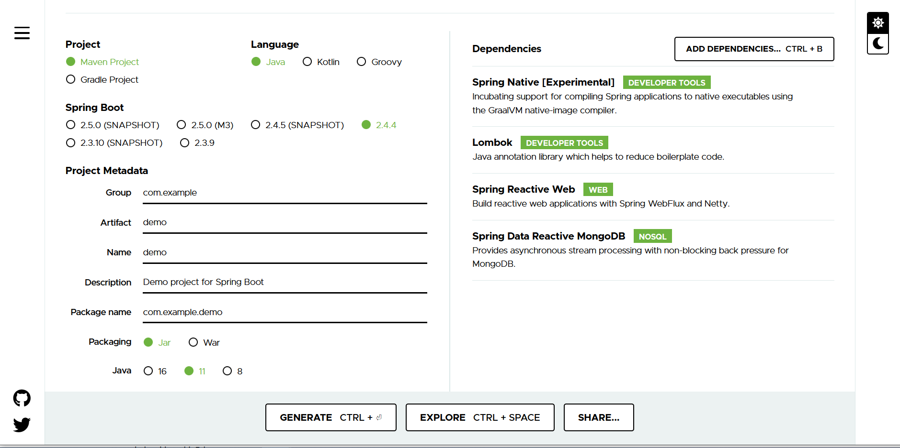

# Building your first Spring Native Application


The [Spring Native beta is released](https://spring.io/blog/2021/03/11/announcing-spring-native-beta), it is great news for Spring developers. Quarkus got GraalVM native image and Kubernetes support since it was born, and Micronaunt and Oracle Helidon also added GraalVM support for a long time.

As explained in the [GraalVM introduction page](https://www.graalvm.org/docs/introduction/), *GraalVM is a high-performance JDK distribution designed to accelerate  the execution of applications written in Java and other JVM languages  along with support for JavaScript, Ruby, Python, and a number of other  popular languages. GraalVM’s polyglot capabilities make it possible to mix multiple  programming languages in a single application while eliminating foreign  language call costs.* 

With GraalVM native image, the Java application can be compiled in a system native executable or shared library, and do not need a Java virtual machine at runtime.

In this post, we will convert a simple existing [reactive mongo example](https://github.com/hantsy/spring-reactive-sample/tree/master/boot-data-mongo-auditing) in the [hantsy/spring-reactive-sample](https://github.com/hantsy/spring-reactive-sample) repository to a native application to experience the new feature brought by Spring Native project.

> Currently, Spring Native is an experimental project, and the 0.9.1 version works with the exact Spring Boot 2.4.4.

## Generating a project

Assuming you have installed the following software.

* Java 11
* Apache Maven 3.8.1
* Docker, required when building the application with `spring-boot:build-image`
* GraalVM 21.0.0.2, required when building native image directly via native image maven plugin.

Open your browser, navigate to https://start.spring.io.



Generate a WebFlux project skeleton with dependencies: Spring Native, Lombok, Spring Reactive Web, Spring Data Reactive MongoDB.

Extract the files from the downloaded archive, and import into your IDE, eg. Intellij IDEA.

## Build the Application

By default the Spring initializr has configured a maven AOT plugin to generate metadata required by GraalVM at compile stage, and a spring boot maven plugin using [paketo buildpack](https://paketo.io/) builder `paketobuildpacks/builder:tiny`  to transform your source codes to a cloud native application(Docker image).

Simply run the following command to build the application into a Docker image.

```bash
mvn clean package spring-boot:build-image
```

The [Spring Native Reference](https://docs.spring.io/spring-native/docs/current/reference/htmlsingle/index.html#getting-started-native-image) also introduced build native application through native image maven plugin.

Copy the source codes from [reactive mongo example](https://github.com/hantsy/spring-reactive-sample/tree/master/boot-data-mongo-auditing) to this project, and refactor the `pom.xml` and introduce multiple maven profiles, and make it work with both cases. 

```xml
<?xml version="1.0" encoding="UTF-8"?>
<project xmlns="http://maven.apache.org/POM/4.0.0" xmlns:xsi="http://www.w3.org/2001/XMLSchema-instance"
         xsi:schemaLocation="http://maven.apache.org/POM/4.0.0 https://maven.apache.org/xsd/maven-4.0.0.xsd">
    <modelVersion>4.0.0</modelVersion>
    <parent>
        <groupId>org.springframework.boot</groupId>
        <artifactId>spring-boot-starter-parent</artifactId>
        <version>2.4.4</version>
        <relativePath/> <!-- lookup parent from repository -->
    </parent>
    <groupId>com.example</groupId>
    <artifactId>spring-native-demo</artifactId>
    <version>0.0.1-SNAPSHOT</version>
    <name>demo</name>
    <description>Demo project for Spring Boot</description>
    <properties>
        <java.version>11</java.version>
        <spring-native.version>0.9.1</spring-native.version>
    </properties>
    <dependencies>
        <dependency>
            <groupId>org.springframework.boot</groupId>
            <artifactId>spring-boot-starter-data-mongodb-reactive</artifactId>
        </dependency>
        <dependency>
            <groupId>org.springframework.boot</groupId>
            <artifactId>spring-boot-starter-webflux</artifactId>
        </dependency>
        <dependency>
            <groupId>org.projectlombok</groupId>
            <artifactId>lombok</artifactId>
            <optional>true</optional>
        </dependency>
        <dependency>
            <groupId>org.springframework.boot</groupId>
            <artifactId>spring-boot-starter-test</artifactId>
            <scope>test</scope>
        </dependency>
        <dependency>
            <groupId>io.projectreactor</groupId>
            <artifactId>reactor-test</artifactId>
            <scope>test</scope>
        </dependency>
    </dependencies>

    <build>
        <plugins>
            <plugin>
                <groupId>org.springframework.boot</groupId>
                <artifactId>spring-boot-maven-plugin</artifactId>
                <configuration>
                    <excludes>
                        <exclude>
                            <groupId>org.projectlombok</groupId>
                            <artifactId>lombok</artifactId>
                        </exclude>
                    </excludes>
                </configuration>
            </plugin>
        </plugins>
    </build>
    <profiles>
        <profile>
            <id>default</id>
            <activation>
                <activeByDefault>true</activeByDefault>
            </activation>
            <build>
                <plugins>
                    <plugin>
                        <groupId>org.apache.maven.plugins</groupId>
                        <artifactId>maven-surefire-plugin</artifactId>
                        <version>3.0.0-M5</version>
                        <configuration>
                            <excludes>
                                <exclude>**/FunctionalTests.*</exclude>
                            </excludes>
                        </configuration>
                    </plugin>
                </plugins>
            </build>
        </profile>
        <profile>
            <id>spring-native</id>
            <dependencies>
                <dependency>
                    <groupId>org.springframework.experimental</groupId>
                    <artifactId>spring-native</artifactId>
                    <version>${spring-native.version}</version>
                </dependency>
            </dependencies>
            <build>
                <plugins>
                    <plugin>
                        <groupId>org.springframework.experimental</groupId>
                        <artifactId>spring-aot-maven-plugin</artifactId>
                        <version>${spring-native.version}</version>
                        <executions>
                            <execution>
                                <id>test-generate</id>
                                <goals>
                                    <goal>test-generate</goal>
                                </goals>
                            </execution>
                            <execution>
                                <id>generate</id>
                                <goals>
                                    <goal>generate</goal>
                                </goals>
                            </execution>
                        </executions>
                    </plugin>
                </plugins>
            </build>
        </profile>
        <profile>
            <id>build-docker-image</id>
            <build>
                <plugins>
                    <plugin>
                        <groupId>org.springframework.boot</groupId>
                        <artifactId>spring-boot-maven-plugin</artifactId>
                        <configuration>
                            <image>
                                <name>hantsy/${project.artifactId}:latest</name>
                                <builder>paketobuildpacks/builder:tiny</builder>
                                <env>
                                    <BP_NATIVE_IMAGE>true</BP_NATIVE_IMAGE>
                                </env>
                            </image>
                        </configuration>
                    </plugin>
                </plugins>
            </build>
        </profile>
        <profile>
            <id>build-native-image</id>
            <build>
                <plugins>
                    <plugin>
                        <groupId>org.springframework.boot</groupId>
                        <artifactId>spring-boot-maven-plugin</artifactId>
                        <configuration>
                            <classifier>exec</classifier>
                        </configuration>
                    </plugin>
                    <plugin>
                        <groupId>org.graalvm.nativeimage</groupId>
                        <artifactId>native-image-maven-plugin</artifactId>
                        <version>21.0.0.2</version>
                        <configuration>
                            <!-- The native image build needs to know the entry point to your application -->
                            <mainClass>com.example.demo.DemoApplication</mainClass>
                        </configuration>
                        <executions>
                            <execution>
                                <goals>
                                    <goal>native-image</goal>
                                </goals>
                                <phase>package</phase>
                            </execution>
                        </executions>
                    </plugin>

                </plugins>
            </build>
        </profile>
        <profile>
            <id>functional-test</id>
            <build>
                <plugins>
                    <plugin>
                        <groupId>org.apache.maven.plugins</groupId>
                        <artifactId>maven-surefire-plugin</artifactId>
                        <version>3.0.0-M5</version>
                        <configuration>
                            <includes>
                                <include>**/FunctionalTests.*</include>
                            </includes>
                        </configuration>
                    </plugin>
                </plugins>
            </build>
        </profile>
    </profiles>
    <repositories>
        <repository>
            <id>spring-releases</id>
            <name>Spring Releases</name>
            <url>https://repo.spring.io/release</url>
        </repository>
    </repositories>
    <pluginRepositories>
        <pluginRepository>
            <id>spring-releases</id>
            <name>Spring Releases</name>
            <url>https://repo.spring.io/release</url>
        </pluginRepository>
    </pluginRepositories>

</project>
```

By default,  we do not contain any Spring native facilities that when run the application it works like a general Spring Boot application.

* The `spring-native` profile contains the build progress of AOT maven plugin.
* The `build-docker-image` will build the application into a docker image via `paketobuildpacks/builder:tiny` builder.
* The `build-native-image` will use GraalVM native image to build the application as system native executable.
* The `functional-test` includes a simple `FunctionalTests` to verify if the application is working as expected from a client view.

### Building with Paket BuildPacks

The Paket BuildPacks requires docker environment, [install it](https://docs.docker.com/engine/install/) firstly.

```bash
mvn clean package spring-boot:build-image -Pspring-native,build-docker-image -DskipTests
```

The application requires a running MongoDB at runtime. There is a [docker-compose.yml](https://github.com/hantsy/spring-native-example/blob/master/docker-compose.yml) available to bootstrap a MongoDB service in seconds.

```bash
docker-compose up mongodb
```

Now run the application as any other Docker applications.

```bash
docker run -rm hantsy/spring-native-demo
```

### Building with Native Image maven plugin

Make sure you have installed GraalVM firstly, follow the [Getting Started](https://www.graalvm.org/docs/getting-started/) guide to install it.

> Under Windows, GraalVM is still experimental. Consider installing it into a Linux system via  WSL2 under Windows. The latest IDEA and VSCode have great WSL2 support.

```bash
mvn clean package spring-boot:build-image -Pspring-native,build-native-image -DskipTests
```

When there is an executable file in the *target* folder. Note before running this command, make sure there is a running Mongo service.

```bash
./target/com.example.demo.demoapplication
```
You will feel the native application building progress is fairly slow and tedious, both way will consume a couple of minutes (not seconds), it is terrible at development stage  for developers. I would like to move it to a CI(continuous integration) service to build it for you.

## Continuous Integrations

I prepared [3 Github actions workflow files](https://github.com/hantsy/spring-native-example/tree/master/.github/workflows) to build the project.

* `build` - build and run testing code like the general Spring Boot applications.
* `build-docker-image` -  build the application into a layered docker image via `spring-boot:build-image` goal, and start up the application and verify it using  `FunctionalTests` mentioned above.
* `build-native-image` - build the application into system native executable via GraalVM native image, and start up it and verify the functionality by running  `FunctionalTests`.

Ideally, when building Spring Native applications, we only need to focus on the development like building a general Spring Boot application, let CI to hand over the tedious work of building native applications.  

But unfortunately, there are a lot of limitations in the current version, check the [Support](https://docs.spring.io/spring-native/docs/current/reference/htmlsingle/index.html#support) section to get a check list of the supported features at the moment. To use those features are not in the support list, you could have to give up *Spring Native* and switch back to use JVM again.

>I also tried to enable Data Mongo auditing feature, it does not work on the native mode. 

Grab a copy of the source codes from [hantsy/spring-native-example](https://github.com/hantsy/spring-native-example/) to experience yourself.


## The Final Words

Quarkus invents the Arc container which provides a subset of CDI APIs for developers, but integrally it produces static codes for beans at compile time instead of generating  dynamic proxies at runtime.

In my opinion, I would like to see some similar mechanism in Spring native that provide compile-time byte code enhancement to replace the Spring built-in dynamic proxies for beans, and make it as an alternative to the current Spring IOC container. 

